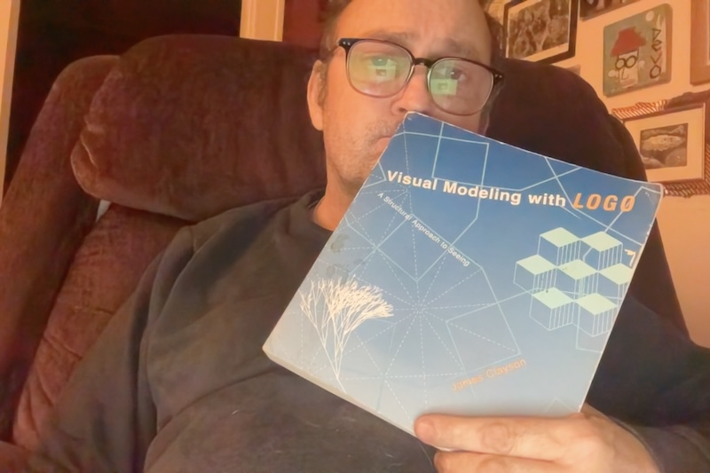
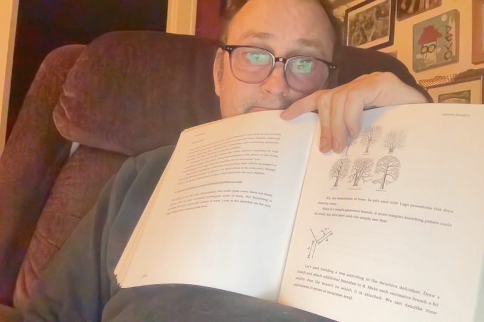

# Visual Modeling

Been thinking about this book a lot lately 

Looked it up before I wandered around the house to find it. [The amazon price was outrageous ($172.57) ](https://www.amazon.com/Visual-Modeling-Logo-Structured-Exploring/dp/0262530694) the apparently [AbesBooks was worse ($241.62) ](https://www.abebooks.com/Visual-Modeling-Logo-Structured-Approach-Seeing/31827290071/bd
).

Z: "Is this the same logo I used on an Apple IIe in elementary school to draw on the screen?"

ME: "This book takes the whole vector based stuff and turns it into a way to think about math, computers and art."

Z: "Huh"
ME: /me goes to look up turntle graphics in python.

ME: I would loan you my copy of it but then I would have to send  you veiled threats 20 years later when I can't find it digitally let alone on paper #lookingatyoujdhildebrandt
And I would buy a copy to loan but apparently now its stupidly expensive.

ME: Also in the mit press logo books from the late 80s [Turtle Geometry](https://www.abebooks.com/Turtle-Geometry-Computer-Medium-Exploring-Mathematics/32225860932/bd): The Computer as a Medium for Exploring Mathematics (Artificial Intelligence) by Abelson, Harold, diSessa, Andrea: Good (1986) | Wonder Book
Free Shipping - ISBN: 9780262510370 - Soft cover - The MIT Press - 1986 - Condition: Good - Good condition. A copy that has been read but remains intact. May contain markings such as bookplates, stamps, limited notes and highlighting, or a few light stains. - Turtle Geometry: The Computer as a Medium for Exploring Mathematics

Z: Crazy, I never knew it as anything but a toy

Back when I was young and smart I spent a lot of time thinking about this turtle geometry stuff (really just vector stuff) but mostly wound up doing real art with a chalk compass and oil pastels meditating on Euclid
Edited6m

- https://www.abebooks.com/Visual-Modeling-Logo-Structured-Approach-Seeing/31827290071/bd
- https://www.amazon.com/Visual-Modeling-Logo-Structured-Exploring/dp/0262530694

